# QML Viewer

English version: [README.en.md](README.en.md)

基于 Electron + React + TypeScript 的 QML 编辑器与预览工具，支持 Electron 桌面模式和纯 Web 浏览器模式。

项目内置一个不依赖 Qt 的 Qt Quick 兼容运行时：解析 QML、在隔离的 QuickJS 中执行绑定和处理器，并通过 retained DOM/Canvas 场景图渲染。它面向常用 UI 的布局与行为验证，不追求 Qt ABI 或像素级等价。

## 功能特性

- **QML 代码编辑**：基于 Monaco Editor，支持语法与语义高亮、上下文补全和代码折叠
- **自渲染预览**：内置 QML → HTML 渲染引擎，右侧面板直接显示渲染结果
- **交互行为预览**：支持常用属性绑定、信号处理、模型、状态、动画和导航行为
- **运行时检查器**：查看当前 QML 对象树、id 和属性快照
- **可调整面板**：左右面板可拖拽调整大小
- **文件操作**：支持打开文件（多选）、打开目录（批量导入 QML）、保存 QML 文件
- **界面设置**：支持中英文界面和日间/夜间主题切换

## 技术栈

- **Electron** - 桌面应用框架（可选）
- **React** - UI 框架
- **TypeScript** - 类型安全
- **Vite** - 构建工具
- **Monaco Editor** - 代码编辑器

## 环境要求

- Node.js >= 18

## 安装

```bash
npm install
```

## 使用方法

### 开发模式（Web）

```bash
npm run dev
```

指定端口运行（注意 `--` 用于把参数透传给 Vite）：

```bash
npm run dev -- --port 5175
```

端口被占用时直接报错（不自动跳到下一个端口）：

```bash
npm run dev -- --port 5175 --strictPort
```

### 开发模式（Windows / Electron）

```bash
npm run dev:win
```

### 构建生产版本（Web）

```bash
npm run build
```

### 完整验证

```bash
npm run check
```

### 构建生产版本（Windows / Electron）

```bash
npm run build:win
```

### 预览构建结果（Web）

```bash
npm run server
```

指定预览端口：

```bash
npm run server -- --port 5175
```

### 预览构建结果（Windows / Electron 窗口）

构建后启动 Electron 桌面应用窗口，用于验证生产构建：

```bash
npm run win
```

## 项目结构

```
qml-viewer/
├── electron/                  # Electron 主进程
│   ├── main.ts               # 主进程入口
│   ├── preload.cjs           # 预加载脚本（文件操作 IPC）
│   └── fileOps.ts            # 文件读写 IPC
├── src/                       # React 渲染进程
│   ├── components/           # React 组件
│   │   ├── EditorPanel.tsx       # 编辑器面板
│   │   ├── PreviewPanel.tsx      # owned runtime 预览和对象检查器
│   │   ├── SplitPane.tsx         # 可拖拽分割面板
│   │   └── Toolbar.tsx           # 工具栏
│   ├── renderer/
│   │   └── parser.ts         # QML 语法解析器
│   ├── runtime/              # 对象、绑定、QuickJS、组件和场景图运行时
│   ├── i18n/                 # 国际化配置
│   │   ├── index.tsx
│   │   ├── zh-CN.ts
│   │   └── en-US.ts
│   ├── utils/
│   │   └── qmlLang.ts        # Monaco QML 语言注册
│   ├── styles/
│   │   └── main.css
│   ├── App.tsx               # 根组件
│   ├── main.tsx              # React 入口
│   └── index.html            # HTML 模板
├── docs/
│   └── plan.md               # 实现计划
├── package.json
├── tsconfig.json
├── tsconfig.node.json
├── vite.config.ts             # Web 模式 Vite 配置
└── vite.win.config.ts         # Windows/Electron 模式 Vite 配置
```

## 功能说明

### 编辑器

- 左侧面板为 QML 代码编辑器
- 支持 QML 语法与语义高亮：类型、属性、信号、处理器、方法、变量、枚举等
- 支持代码自动补全、代码折叠和括号匹配

#### 上下文补全快捷键

| 快捷键 | 作用 | 使用位置 |
|--------|------|----------|
| `Alt+/` | 显示当前 QML 对象可写的属性，包括 `anchors`、`Layout`、`font` 等分组属性 | 将光标放在对象的 `{ ... }` 内，例如 `Button { }` 内 |
| `Alt+.` | 显示适合当前对象的子控件；在顶层显示 `pragma`、`import` 和可用根类型 | 将光标放在对象块内添加子项，或放在对象块外添加顶层声明 |

选择建议后按 `Enter` 或 `Tab` 插入。属性值输入到冒号后，编辑器还会根据属性类型提示布尔值、枚举、颜色、模型引用等可用值。

### 预览（自渲染引擎）

- 右侧面板为 QML 预览区
- 内置 QML → HTML 渲染引擎，将 QML 代码解析并渲染为 HTML/CSS
- 点击"刷新预览"按钮即可更新预览
- 支持常用 Qt Quick 基础元素、布局、Qt Quick Controls、视图、模型和委托
- 支持 anchors、Row/Column、Grid/Flow 以及 Qt Quick Layouts 的常见布局方式
- 支持属性绑定、事件处理器、状态、过渡和常用动画 API
- 支持 ListView、GridView、PathView、TableView、TreeView 等常用数据视图的预览
- ChartView、WebEngineView、VideoOutput 和部分图形效果采用浏览器能力近似实现

详细支持范围和已知差异见 [QML 兼容性清单](docs/qml-compatibility-checklist.md)。

### 文件操作

- **打开文件**：点击工具栏"打开文件"按钮，可多选 `.qml` 文件并加入左侧文件列表
- **打开目录**：点击工具栏"打开目录"按钮，批量导入目录中的 `.qml` 文件
- **保存文件**：点击工具栏"保存文件"按钮
  - Electron 模式：保存到本地文件系统
  - Web 模式：直接保存到文件（依赖 File System Access API）

### 语言切换

- 点击工具栏右侧的语言按钮，可切换中英文界面

## 渲染引擎说明

### 支持范围

渲染引擎面向 QML 界面验证，覆盖常见控件、布局、绑定、信号、模型、视图、状态和动画。部分复杂控件及 Qt 运行时语义使用浏览器近似实现，完整状态以 [QML 兼容性清单](docs/qml-compatibility-checklist.md) 为准。

### 工作原理

1. `renderer/parser.ts` 将 QML 解析为带源码位置的语法树
2. `runtime/QmlDocument.ts` 创建对象树并激活绑定、处理器和 Loader
3. `runtime/QmlJsEngine.ts` 在隔离的 QuickJS WASM 中执行 JavaScript
4. `runtime/QmlDomSceneGraph.ts` 把 retained 对象树投影到 DOM、Canvas 和 WebGL

## QML 类型继承关系

```plantuml
@startuml QML Type Hierarchy
hide members
skinparam classBackgroundColor #FFFDE7
skinparam classBorderColor #78909C
skinparam arrowColor #546E7A

package "核心基础 QtObject" {
  class QtObject
  class Connections
  class Timer
  class Component
  class ListModel
  class ListElement
  class Action
  class ActionGroup
  class Shortcut
  class Path
}

package "Transform / Animation" {
  class Transform
  class Translate
  class Scale
  class Rotation
  class NumberAnimation
  class PropertyAnimation
  class ColorAnimation
  class Vector3dAnimation
  class PauseAnimation
  class ScriptAction
  class SequentialAnimation
  class ParallelAnimation
  class State
  class PropertyChanges
  class Transition
  class Behavior
}

package "Item 基础可视元素" {
  class Item
  class FocusScope
  class Rectangle
  class Text
  class Label
  class Image
  class Canvas
  class ShaderEffect
  class ParticleSystem
  class ChartView
  class DropShadow
  class OpacityMask
  class MouseArea
  class Loader
  class Repeater
  class WebEngineView
  class VideoOutput
}

package "布局 & 定位" {
  class Row
  class Column
  class Grid
  class Flow
  class RowLayout
  class ColumnLayout
  class GridLayout
  class StackLayout
}

package "视图 & 滚动" {
  class Flickable
  class ScrollView
  class ListView
  class GridView
  class PathView
  class TableView
  class TreeView
  class HorizontalHeaderView
  class VerticalHeaderView
}

package "Window" {
  class Window
  class ApplicationWindow
}

package "Control 体系" {
  class Control
  class Button
  class RoundButton
  class ToolButton
  class TabButton
  class ItemDelegate
  class DelayButton
  class MenuItem
  class CheckBox
  class RadioButton
  class Switch
  class TabBar
  class TextField
  class TextInput
  class TextArea
  class TextEdit
  class Slider
  class Dial
  class RangeSlider
  class SpinBox
  class Tumbler
  class ComboBox
  class ProgressBar
  class BusyIndicator
  class Pane
  class Frame
  class GroupBox
  class Page
  class SwipeView
  class StackView
  class SplitView
  class MenuBar
  class ToolBar
  class Popup
  class Dialog
  class Menu
  class Drawer
  class ToolTip
  class Calendar
  class DatePicker
  class TimePicker
  class ScrollIndicator
  class ScrollBar
  class MenuSeparator
}

' QtObject 层
QtObject <|-- Connections
QtObject <|-- Timer
QtObject <|-- Component
QtObject <|-- ListModel
QtObject <|-- ListElement
QtObject <|-- Action
QtObject <|-- ActionGroup
QtObject <|-- Shortcut
QtObject <|-- Path
QtObject <|-- Transform
Transform <|-- Translate
Transform <|-- Scale
Transform <|-- Rotation
QtObject <|-- NumberAnimation
NumberAnimation <|-- PropertyAnimation
NumberAnimation <|-- ColorAnimation
NumberAnimation <|-- Vector3dAnimation
QtObject <|-- PauseAnimation
QtObject <|-- ScriptAction
QtObject <|-- SequentialAnimation
SequentialAnimation <|-- ParallelAnimation
QtObject <|-- State
QtObject <|-- PropertyChanges
QtObject <|-- Transition
QtObject <|-- Behavior

' Item 层
QtObject <|-- Item
Item <|-- FocusScope
Item <|-- Rectangle
Item <|-- Text
Text <|-- Label
Item <|-- Image
Item <|-- Canvas
Canvas <|-- ShaderEffect
Canvas <|-- ParticleSystem
Canvas <|-- ChartView
Item <|-- DropShadow
Item <|-- OpacityMask
Item <|-- MouseArea
Item <|-- Loader
Item <|-- Repeater
Item <|-- WebEngineView
Item <|-- VideoOutput

' 布局
Item <|-- Row
Item <|-- Column
Item <|-- Grid
Item <|-- Flow
Item <|-- RowLayout
Item <|-- ColumnLayout
Item <|-- GridLayout
Item <|-- StackLayout

' 视图
Item <|-- Flickable
Flickable <|-- ScrollView
Flickable <|-- ListView
Flickable <|-- GridView
Flickable <|-- PathView
Flickable <|-- TableView
Flickable <|-- TreeView
Item <|-- HorizontalHeaderView
Item <|-- VerticalHeaderView

' Window
Item <|-- Window
Window <|-- ApplicationWindow

' Control 层
Item <|-- Control
Control <|-- Button
Button <|-- RoundButton
Button <|-- ToolButton
Button <|-- TabButton
Button <|-- ItemDelegate
Button <|-- DelayButton
Button <|-- MenuItem
Button <|-- CheckBox
CheckBox <|-- RadioButton
CheckBox <|-- Switch
Control <|-- TabBar
Control <|-- TextField
TextField <|-- TextInput
TextField <|-- TextArea
TextArea <|-- TextEdit
Control <|-- Slider
Slider <|-- Dial
Control <|-- RangeSlider
Control <|-- SpinBox
Control <|-- Tumbler
Control <|-- ComboBox
Control <|-- ProgressBar
Control <|-- BusyIndicator
Control <|-- Pane
Pane <|-- Frame
Frame <|-- GroupBox
Pane <|-- Page
Control <|-- SwipeView
Control <|-- StackView
Control <|-- SplitView
Control <|-- MenuBar
Control <|-- ToolBar
Control <|-- Popup
Popup <|-- Dialog
Popup <|-- Menu
Popup <|-- Drawer
Popup <|-- ToolTip
Control <|-- Calendar
Control <|-- DatePicker
Control <|-- TimePicker
Control <|-- ScrollIndicator
Control <|-- ScrollBar
Control <|-- MenuSeparator

@enduml
```



## 许可证

ISC
